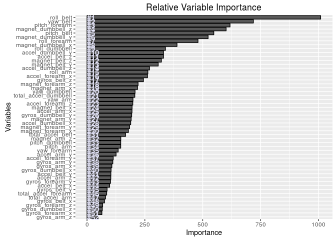

# Practical Machine Learning: Predicting Quality of Exercise
Valter Beaković  
April 17, 2016  
#### **Note**
**Use rmarkdown::render("pml_course_project.Rmd") to knit the md and html files when reproducing the research!**

Set locale to English (default is Croatian on the PC used to produce the document)

```r
Sys.setlocale("LC_ALL", "en_GB.UTF-8")
```
The R code uses functions from various libraries. The code bellow installs and loads the 
required libraries.

```r
packages <- c("ggplot2", "dplyr", "caret", "randomForest")
if (length(setdiff(packages, rownames(installed.packages()))) > 0) {
  install.packages(setdiff(packages, rownames(installed.packages())))  
}

library(ggplot2)
library(dplyr)
library(caret)
library(randomForest)
```


## Loading the data

The data used for the research comes from sensors in the users’ glove, armband, lumbar belt and
dumbbell. The datasets are is in the ./data folder stored as csv files.

The first step is to extract the csv file containing the activitiy data from the
archive.

The code bellow loads the training and testing activity data into a data frame:

```r
# training data
if (file.exists("./files/pml-training.csv")) {
        training <- read.csv("./files/pml-training.csv")                
}
# testing data
if (file.exists("./files/pml-testing.csv")) {
        testing <- read.csv("./files/pml-testing.csv")                
}
```

## Cleaning the data

The training dataset cointains 19622 observations and 160 variables while the testing dataset has 20 observations and the same number of variables. 

A look at the structure of the data set show that many variables are mostly NA's:

```r
# result not printed to save space.
str(training)
```

The following code identifies and removes the mostly NA variables:

```r
# remove variables with mostly NA's with a treshold of 95%
training <- training[ , colSums(is.na(training)) < nrow(training)*0.95]
```

In total 67 varibles has been removed consiting of mostly NA's. 
Next we'll identify Zero and Near Zero Variance predictors and remove them from the dataset:
The following code identifies and removes the mostly NA variables:

```r
# remove Zero and Near Zero Variance predictors
training <- training[ , -(nearZeroVar(training))]
```

In total 34 varibles has been removed being Zero and Near Zero Variance predictors. The documentation of the Caret package explains the motivation to remove those variables:

The concern here that these predictors may become zero-variance predictors when the data are split into cross-validation/bootstrap sub-samples or that a few samples may have an undue influence on the model. These "near-zero-variance" predictors may need to be identified and eliminated prior to modeling. 

Additionally the first 6 columns will be removed since those columns will not be included in modeling.

```r
training <- training[ , -c(1:6)]
```

## Creating the training and validation dataset

The training dataset will be split in a training and validation data set. The validation data set will be used to estimate the out of sample error.

```r
# creat training and validation dataset
set.seed(777)
inTrain <- createDataPartition(y=training$classe, p=0.8, list=F)
training.train <- training[inTrain, ]
training.validate <- training[-inTrain, ]
```

## Data exploration


```r
# table of observation by class
table(training.train$classe)
```

```
## 
##    A    B    C    D    E 
## 4464 3038 2738 2573 2886
```

The correct exercice (class A) has most observation while the rest of the classes has similar number of observations. 

Next a look at correlations:

```r
# find correlated variables
corr <- cor(training.train[, -which(names(training.train) %in% c("classe"))])
findCorrelation(corr, cutoff = .90, verbose = FALSE,
                names = TRUE, exact = ncol(corr) < 100)
```

```
## [1] "accel_belt_z"     "roll_belt"        "accel_belt_y"    
## [4] "accel_belt_x"     "gyros_dumbbell_x" "gyros_dumbbell_z"
## [7] "gyros_arm_x"
```

We have 7 highly correlated variables. Later will see it the variables make it to the top 10 most important variables.

## Modeling

The original study used Random Forest with Leave one out cross-validation. I'll stick with Random forest but switch to 3-fold cross-valdation for performance reasons:


```r
# model Random forest to detect most important variables
set.seed(777)
rf.mod <- randomForest(classe ~ ., 
                       data = training.train, 
                       ntree = 600, 
                       importance = TRUE)
# Get importance
importance    <- importance(rf.mod)
varImportance <- data.frame(Variables = row.names(importance), 
                            Importance = round(importance[ ,'MeanDecreaseGini'],2))

# Create a rank variable based on importance
rankImportance <- varImportance %>%
        mutate(Rank = paste0('#',dense_rank(desc(Importance))))
ggplot(rankImportance, aes(x = reorder(Variables, Importance), 
                           y = Importance)) +
        geom_bar(stat='identity', colour = 'black') +
        geom_text(aes(x = Variables, y = 0.5, label = Rank),
                  hjust=0, vjust=0.55, size = 4, colour = 'lavender',
                  fontface = 'bold') +
        labs(x = 'Variables', title = 'Relative Variable Importance') +
        coord_flip() 
```



Let's try to model with only 10 variables. The correlated variables did not emerge in the top 10, we'll use just "roll_belt":


```r
# top 10 variables
set.seed(777)
vars <- c( "roll_belt", "yaw_belt", "pitch_forearm", "magnet_dumbbell_z",   
          "pitch_belt", "magnet_dumbbell_y", "roll_forearm", "magnet_dumbbell_x", 
          "roll_dumbbell", "accel_dumbbell_y")
# train control
train.param <- trainControl(method="cv", number=3, verboseIter=F)
# train random forest model
predictors = paste(vars, collapse="+") 
fml = as.formula(sprintf('%s ~ %s', "classe", predictors))
fit.model <- train(fml, data=training.train, method="rf", trControl=train.param)
# print the final model
fit.model$finalModel
```

```
## 
## Call:
##  randomForest(x = x, y = y, mtry = param$mtry) 
##                Type of random forest: classification
##                      Number of trees: 500
## No. of variables tried at each split: 2
## 
##         OOB estimate of  error rate: 1.5%
## Confusion matrix:
##      A    B    C    D    E class.error
## A 4429   16   16    3    0 0.007840502
## B   32 2945   47   14    0 0.030612245
## C    3   28 2688   18    1 0.018261505
## D    0    2   28 2539    4 0.013214147
## E    0    9    4   11 2862 0.008316008
```

Estimating the training set error:

```r
# predict
preds.train <- predict(fit.model)
# show confusion matrix to get estimate of in-sample error
conf.matrix.train <- confusionMatrix(training.train$classe, preds.train)
conf.matrix.train
```

```
## Confusion Matrix and Statistics
## 
##           Reference
## Prediction    A    B    C    D    E
##          A 4464    0    0    0    0
##          B    0 3038    0    0    0
##          C    0    0 2738    0    0
##          D    0    0    0 2573    0
##          E    0    0    0    0 2886
## 
## Overall Statistics
##                                      
##                Accuracy : 1          
##                  95% CI : (0.9998, 1)
##     No Information Rate : 0.2843     
##     P-Value [Acc > NIR] : < 2.2e-16  
##                                      
##                   Kappa : 1          
##  Mcnemar's Test P-Value : NA         
## 
## Statistics by Class:
## 
##                      Class: A Class: B Class: C Class: D Class: E
## Sensitivity            1.0000   1.0000   1.0000   1.0000   1.0000
## Specificity            1.0000   1.0000   1.0000   1.0000   1.0000
## Pos Pred Value         1.0000   1.0000   1.0000   1.0000   1.0000
## Neg Pred Value         1.0000   1.0000   1.0000   1.0000   1.0000
## Prevalence             0.2843   0.1935   0.1744   0.1639   0.1838
## Detection Rate         0.2843   0.1935   0.1744   0.1639   0.1838
## Detection Prevalence   0.2843   0.1935   0.1744   0.1639   0.1838
## Balanced Accuracy      1.0000   1.0000   1.0000   1.0000   1.0000
```

```r
# in sample error
in.sample.error <- 1 - conf.matrix.train$overall[1]
names(in.sample.error) <- "Training set error"
in.sample.error
```

```
## Training set error 
##                  0
```

On the training set the accuracy is 100%.
The final model with 10 predictors looks well, let's see how he model does on the validation set:


```r
# predict
preds.validate <- predict(fit.model, newdata=training.validate)
# show confusion matrix to get estimate of out-of-sample error
conf.matrix.validate <- confusionMatrix(training.validate$classe, preds.validate)
conf.matrix.validate
```

```
## Confusion Matrix and Statistics
## 
##           Reference
## Prediction    A    B    C    D    E
##          A 1109    4    3    0    0
##          B   12  734    5    8    0
##          C    0    6  675    3    0
##          D    0    2    3  638    0
##          E    0    6    7    2  706
## 
## Overall Statistics
##                                           
##                Accuracy : 0.9845          
##                  95% CI : (0.9801, 0.9881)
##     No Information Rate : 0.2858          
##     P-Value [Acc > NIR] : < 2.2e-16       
##                                           
##                   Kappa : 0.9803          
##  Mcnemar's Test P-Value : NA              
## 
## Statistics by Class:
## 
##                      Class: A Class: B Class: C Class: D Class: E
## Sensitivity            0.9893   0.9761   0.9740   0.9800   1.0000
## Specificity            0.9975   0.9921   0.9972   0.9985   0.9953
## Pos Pred Value         0.9937   0.9671   0.9868   0.9922   0.9792
## Neg Pred Value         0.9957   0.9943   0.9944   0.9960   1.0000
## Prevalence             0.2858   0.1917   0.1767   0.1659   0.1800
## Detection Rate         0.2827   0.1871   0.1721   0.1626   0.1800
## Detection Prevalence   0.2845   0.1935   0.1744   0.1639   0.1838
## Balanced Accuracy      0.9934   0.9841   0.9856   0.9893   0.9977
```

Estimation of the out of sample error:


```r
# calculating the out of sample error
out.sample.error <- 1 - conf.matrix.validate$overall[1]
names(out.sample.error) <- "Out of sample error"
out.sample.error
```

```
## Out of sample error 
##          0.01554932
```

The out of sample error is 1.55 %. Considering that not many models were tested and even the Random forest model was not tested with different train parameters the result is satisfactory.

## Conclusion

A quick and simple modeling based on 10 most important variables estimated with the Random forest algorithm produced accurate results. It would be interesting to explore further combinations of variables and models and maybe get an even simpler model with satisfatory accuracy. The used model scored 100% on the course prediction quiz.


